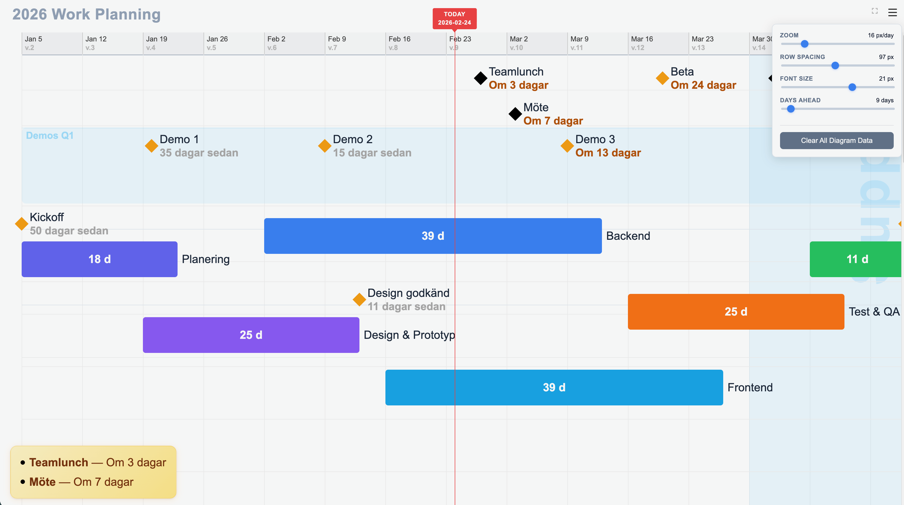
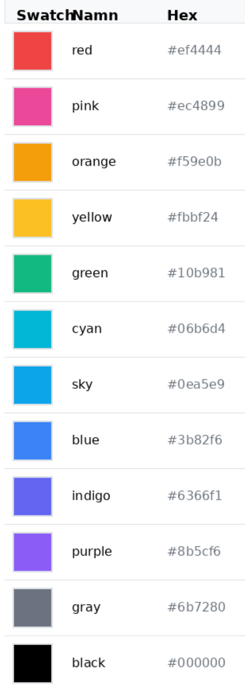

# Mini-Timeline

A not-so-small Gantt-type interactive timeline for project visualization, perfect for team dashboard TVs etc.



# Quick Start

1. Open `timeline.html` in browser
2. Drag & drop a JSON file, or
3. Use hamburger menu (⚙️) → Clear All Diagram Data to start fresh

## JSON Format

```json
[
  { "title": "2026 Work Planning" },
  { "activity": "Planering", "start": "2026-01-05", "end": "2026-01-23" },
  { "activity": "Design & Prototyp", "start": "2026-01-19", "end": "2026-02-13" },
  { "activity": "Backend", "start": "2026-02-02", "end": "2026-03-13" },
  { "activity": "Frontend", "start": "2026-02-16", "end": "2026-03-27" },
  { "activity": "Test & QA", "start": "2026-03-16", "end": "2026-04-10" },
  { "activity": "Driftsättning", "start": "2026-04-06", "end": "2026-04-17"},
  { "activity": "Kickoff", "date": "2026-01-05", "lane": "green"},
  { "activity": "Demo 1", "date": "2026-01-20", "lane": "test"},
  { "activity": "Demo 2", "date": "2026-02-09", "lane": "test"},
  { "activity": "Demo 3", "date": "2026-03-09", "lane": "test"},
  { "activity": "Design\ngodkänd", "date": "2026-02-13" },
  { "activity": "Beta", "date": "2026-03-20" },
  { "activity": "Release\nv1.0", "date": "2026-04-17" },
  { "activity": "Möte", "date": "2026-03-03", "color": "black", "highlight": true, "url": "https://meet.google.com/xyz" },
  { "activity": "Event", "date": "2026-04-02", "color": "black", "highlight": true },
  { "activity": "Teamlunch", "date": "2026-02-27", "color": "black", "highlight": true},
  { "lane": "test", "title": "Demos Q1", "color": "lightblue" },
  { "activity": "Support", "start": "2026-03-30", "end": "2026-04-27", "type": "area", "color": "lightblue" }
]
```

## Item Types

**Bar** (activity with duration):
```json
{ "activity": "Backend", "start": "2026-02-02", "end": "2026-03-13" }
```

**Diamond** (milestone):
```json
{ "activity": "Release v1.0", "date": "2026-04-17" }
```

**Area** (background band):
```json
{ "activity": "Support", "start": "2026-03-30", "end": "2026-04-27", "type": "area", "color": "lightblue" }
```

**Highlight** (notification box):
```json
{ "activity": "Möte", "date": "2026-03-03", "color": "black", "highlight": true, "url": "https://meet.google.com/xyz" }
```

## Colored Lanes

Group related items in dedicated colored lanes:

```json
// 1. Define lane
{ "lane": "demos", "title": "Monthly Demos", "color": "purple" }

// 2. Reference lane in items
{ "activity": "Demo 1", "date": "2026-01-15", "lane": "demos" }
{ "activity": "Planering", "start": "2026-01-05", "end": "2026-01-23", "lane": "demos" }
```

**Lane structure:** Each colored lane contains up to 3 sections:
1. Fristående diamonds (not snapped to bars)
2. Snapped diamonds (diamonds matching bar start dates)
3. Bars

**Validation:** Invalid lane references fallback to standalone/regular rendering with warning banner.

## Colors

Note: You dont have to set a color, they'll be set for you via a small pool of nice colors. The colors below are just for reference if you want to set one by your self via the color attribute.



## Settings (Menu)

- **Zoom** - Pixels per day
- **Row spacing** - Vertical spacing between items
- **Font size** - Text size
- **Days ahead** - Notification box range (0 = Off)
- **Clear All Diagram Data** - Reset to empty state

## Features

- **Auto-save** - Data persists in localStorage
- **Collision detection** - Diamonds auto-pack into multiple rows
- **Snapping** - Diamonds on bar start dates attach above bar
- **Drag & drop** - Load JSON files
- **Pan & scroll** - Arrow keys to navigate, any other key returns to today
- **Auto-colors** - Items without explicit colors get assigned from palette
- **Line breaks** - Use `\n` in activity names

## Data Storage

All data stored in browser localStorage. "Clear All Diagram Data" only removes app data - your original JSON files are unaffected.