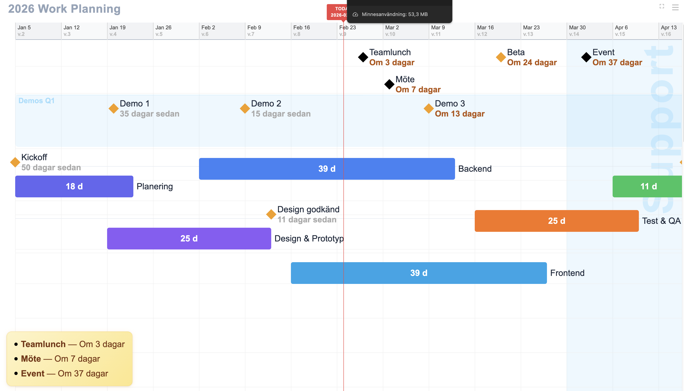

# Mini-Timeline

En enkel, visuell projektplanering för team-skärmar. Perfekt för att hålla teamet uppdaterat om projektstatus utan överflödig komplexitet.



## Vad är Mini-Timeline?

Mini-Timeline är ett minimalistiskt verktyg för att visa projektplaner på en permanent skärm i teamrummet. Ingen installation, ingen server, ingen databas. Bara en HTML-fil och en JSON-config du själv skriver.

## Hur fungerar det?

1. Öppna `timeline.html` i en webbläsare (Chrome, Firefox, Safari etc)
2. Skapa din projektplan som en JSON-fil
3. Drag-and-drop JSON-filen till webbläsaren
4. Klar! Din tidslinje uppdateras direkt

Perfekt för att köra på en permanent skärm i teamrummet. När projektet ändras, släpp bara in en ny JSON-fil.

## Funktioner

- Veckobaserad tidslinje med ISO-veckonummer (v.1, v.2 osv)
- Aktiviteter visas som färgade staplar
- Milestones (diamanter) för viktiga datum
- Klickbara länkar till Jira, Google Meet, dokument etc
- Event horizon: visa kommande händelser i en notis-box
- Fullscreen-läge (tryck ESC för att avsluta)
- Navigera med piltangenter, tryck valfri annan tangent för att återgå till idag
- Anpassningsbar zoom, fontstorlek och radavstånd via inställningar

## Konfigurations-guide

Din projektplan definieras i en JSON-fil. Här är de olika typerna av objekt du kan använda:

### Titel

```json
{ "title": "2026 Work Planning" }
```

Visas som stort rubrik uppe till vänster.

### Aktiviteter (staplar)

```json
{
  "activity": "Backend",
  "start": "2026-02-02",
  "end": "2026-03-13",
  "color": "blue",
  "url": "https://jira.company.com/PROJ-123"
}
```

- `activity`: Namnet på aktiviteten
- `start` och `end`: Datum i formatet YYYY-MM-DD
- `color`: Färgnamn (se lista nedan)
- `url`: Valfri länk (klicka på stapeln för att öppna)

### Milestones (diamanter)

```json
{
  "activity": "Kickoff",
  "date": "2026-01-05",
  "url": "https://meet.google.com/abc-defg"
}
```

- `date`: Ett enskilt datum
- Visar en diamant-ikon på tidslinjen
- Kan också ha färg och url

### Händelser (visas i notis-boxen)

```json
{
  "activity": "Teamlunch",
  "date": "2026-02-27",
  "color": "black",
  "type": "note"
}
```

- `type: "note"`: Gör att händelsen visas i den gula notis-boxen
- Notis-boxen visar händelser inom din valda "event horizon" (standard 60 dagar)

### Bakgrundsområden

```json
{
  "activity": "Vacation",
  "start": "2026-04-06",
  "end": "2026-04-29",
  "type": "area",
  "color": "lightblue"
}
```

- `type: "area"`: Skapar ett genomskinligt färgat område i bakgrunden
- Användbart för semester, helgdagar, deadlines etc

## Färger

Använd dessa färgnamn i `color`-fältet:

**Blues**: `lightblue`, `skyblue`, `blue`, `darkblue`, `indigo`

**Purples**: `purple`, `violet`

**Greens**: `green`, `lightgreen`, `darkgreen`

**Yellows/Oranges**: `yellow`, `orange`, `amber`

**Reds/Pinks**: `red`, `pink`

**Neutrals**: `gray`, `slate`, `black`

**Cyans/Teals**: `cyan`, `teal`

Du kan också använda hex-koder direkt, t.ex. `"color": "#3b82f6"`

## Datum-format

Mini-Timeline stödjer två format:

**Standard datum**: `"2026-03-15"`

**ISO-veckor**: `"2026-W12"` (vecka 12, 2026)

## Komplett exempel

```json
[
  { "title": "2026 Work Planning" },
  { 
    "activity": "Planering",
    "start": "2026-01-05",
    "end": "2026-01-23",
    "color": "indigo"
  },
  { 
    "activity": "Design & Prototyp",
    "start": "2026-01-19",
    "end": "2026-02-13",
    "color": "purple"
  },
  { 
    "activity": "Backend",
    "start": "2026-02-02",
    "end": "2026-03-13",
    "color": "blue"
  },
  { 
    "activity": "Kickoff",
    "date": "2026-01-05",
    "url": "https://meet.google.com/abc-defg"
  },
  { 
    "activity": "Beta",
    "date": "2026-03-20",
    "url": "https://beta.example.com"
  },
  { 
    "activity": "Teamlunch",
    "date": "2026-02-27",
    "color": "black",
    "type": "note"
  },
  { 
    "activity": "Vacation",
    "start": "2026-04-06",
    "end": "2026-04-29",
    "type": "area",
    "color": "lightblue"
  }
]
```

## Inställningar

Klicka på hamburger-menyn uppe till höger för att justera:

- **Zoom**: Hur många pixlar per dag (6-60 px)
- **Row spacing**: Avstånd mellan aktivitetsrader (40-160 px)
- **Font size**: Textstorlek för hela applikationen (14-25 px)
- **Event horizon**: Hur långt fram i tiden händelser ska visas (7-160 dagar)

Alla inställningar sparas automatiskt i webbläsaren.

## Tangentbords-genvägar

- **Vänsterpil**: Scrolla bakåt en dag
- **Högerpil**: Scrolla framåt en dag
- **Håll inne pil**: Snabb scrollning
- **Valfri annan tangent**: Återgå till idag
- **Dubbelklick**: Återgå till idag
- **ESC**: Avsluta fullscreen

## Tips för team-skärmar

1. Kör webbläsaren i fullscreen-läge (F11 i de flesta webbläsare)
2. Inaktivera skärmsläckare
3. Lägg JSON-filen på en nätverksdel som alla kan nå
4. Uppdatera JSON-filen när projektet ändras
5. Släpp in filen på skärmen för att uppdatera tidslinjen

## Tekniska detaljer

- Ren vanilla JavaScript, inga dependencies
- All data lagras i localStorage i webbläsaren
- Fungerar offline efter första laddningen
- Kompatibel med alla moderna webbläsare

## Licens

Fri att använda och modifiera.
