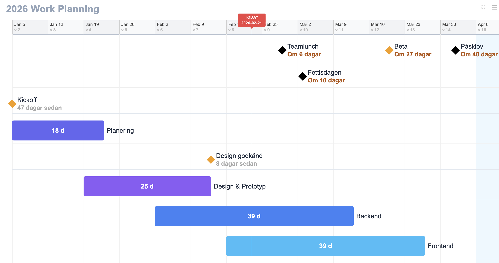

# Mini-Timeline

En interaktiv tidslinje för projektplanering. Perfekt för team-skärmar.



## Snabbstart

1. Öppna `timeline.html` i din webbläsare
2. Drag-drop `timeline.json` på sidan
3. Navigera med piltangenterna (← →)
4. Tryck valfri annan tangent för att hoppa till TODAY

Data sparas automatiskt i localStorage.

## Features

- Drag-drop JSON för att ladda data
- Keyboard navigation (piltangenter)
- Auto-färger (6 färger roterar automatiskt)
- Milstolpar, aktiviteter, och area blocks
- Sparas i localStorage - funkar efter reload
- Klickbara länkar på events
- Fullscreen-läge (tryck ESC för att avsluta)

## JSON Format

Se `timeline.json` i repot för ett komplett exempel. Din projektplan definieras i en JSON-array med olika objekt:

### Titel

```json
{ "title": "2026 Work Planning" }
```

Visas som stort rubrik uppe till vänster.

### Aktiviteter (staplar)

```json
{
  "activity": "Backend",
  "start": "2026-02-02",
  "end": "2026-03-13",
  "color": "blue",
  "url": "https://jira.company.com/PROJ-123"
}
```

- `activity`: Namnet på aktiviteten
- `start` och `end`: Datum i formatet YYYY-MM-DD
- `color`: Färgnamn (se lista nedan)
- `url`: Valfri länk (klicka på stapeln för att öppna)

### Milestones (diamanter)

```json
{
  "activity": "Kickoff",
  "date": "2026-01-05",
  "url": "https://meet.google.com/abc-defg"
}
```

- `date`: Ett enskilt datum
- Visar en diamant-ikon på tidslinjen
- Kan också ha färg och url

### Händelser (visas i notis-boxen)

```json
{
  "activity": "Teamlunch",
  "date": "2026-02-27",
  "highlight": true
}
```

- `highlight: true`: Gör att händelsen visas i den gula activity-boxen
- Activity-boxen visar händelser inom din valda "event horizon" (standard 60 dagar)

### Bakgrundsområden

```json
{
  "activity": "Vacation",
  "start": "2026-04-06",
  "end": "2026-04-29",
  "type": "area",
  "color": "lightblue"
}
```

- `type: "area"`: Skapar ett genomskinligt färgat område i bakgrunden
- Användbart för semester, helgdagar, deadlines etc

## Färger

### Auto-färger

**Aktiviteter (bars) får automatiskt snygga färger om du INTE anger `color`!**

Mini-Timeline använder en roterande färgpool med 6 färger:

1. **Indigo** (#6366f1) - indigo-blå
2. **Purple** (#8b5cf6) - lila
3. **Blue** (#3b82f6) - blå
4. **Sky** (#0ea5e9) - cyan/ljusblå
5. **Orange** (#f97316) - orange
6. **Green** (#22c55e) - grön

Färgerna roterar automatiskt. Du behöver alltså inte ange `color` för aktiviteter!

### Manuella färger

Om du vill kan du fortfarande ange färger manuellt:

**Blues**: `lightblue`, `skyblue`, `blue`, `darkblue`, `indigo`
**Purples**: `purple`, `violet`
**Greens**: `green`, `lightgreen`, `darkgreen`
**Yellows/Oranges**: `yellow`, `orange`, `amber`
**Reds/Pinks**: `red`, `pink`
**Neutrals**: `gray`, `slate`, `black`
**Cyans/Teals**: `cyan`, `teal`

Du kan också använda hex-koder direkt, t.ex. `"color": "#3b82f6"`

## Datum-format

Mini-Timeline stödjer två format:

**Standard datum**: `"2026-03-15"`

**ISO-veckor**: `"2026-W12"` (vecka 12, 2026)

## Komplett exempel

```json
[
  { "title": "2026 Work Planning" },
  { 
    "activity": "Planering",
    "start": "2026-01-05",
    "end": "2026-01-23"
  },
  { 
    "activity": "Design & Prototyp",
    "start": "2026-01-19",
    "end": "2026-02-13"
  },
  { 
    "activity": "Backend",
    "start": "2026-02-02",
    "end": "2026-03-13"
  },
  { 
    "activity": "Kickoff",
    "date": "2026-01-05",
    "url": "https://meet.google.com/abc-defg"
  },
  { 
    "activity": "Beta",
    "date": "2026-03-20",
    "url": "https://beta.example.com"
  },
  { 
    "activity": "Teamlunch",
    "date": "2026-02-27",
    "highlight": true
  },
  { 
    "activity": "Vacation",
    "start": "2026-04-06",
    "end": "2026-04-29",
    "type": "area",
    "color": "lightblue"
  }
]
```

## Inställningar

Klicka på hamburger-menyn uppe till höger för att justera:

- **Zoom**: Hur många pixlar per dag (6-60 px)
- **Row spacing**: Avstånd mellan aktivitetsrader (40-160 px)
- **Font size**: Textstorlek för hela applikationen (14-25 px)
- **Event horizon**: Hur långt fram i tiden händelser ska visas (7-160 dagar)

Alla inställningar sparas automatiskt i webbläsaren.

### Smart Lane Packing

Mini-Timeline använder en **enkel top-down lane-packing** algoritm:

**Hur det fungerar:**
1. Sorterar aktiviteter efter starttid (kronologisk ordning)
2. För varje aktivitet:
   - Testa lane 0, 1, 2... från toppen
   - Placera aktiviteten i första lane där den INTE överlappar tidsmässigt
   - Om ingen lane passar: skapa ny lane längst ner
3. Aktiviteter i samma lane delar Y-position (visuellt på samma rad)

**Exempel:**
- **Planering** (jan 5-23) → Lane 0
- **Design** (jan 19-feb 13) → Lane 1 (överlappar Planering)
- **Backend** (feb 2-mar 16) → Lane 0 (Planering slutade jan 23 - ingen överlapp!)
- **Driftsättning** (apr 6-17) → Lane 0 (fortfarande plats!)

**Resultat:** Automatiskt tätt packade rader utan tomma mellanrum!

**Diamond lanes:** Bara 65% av normal höjd för kompaktare layout.

## Tangentbords-genvägar

- **Vänsterpil**: Scrolla bakåt en dag
- **Högerpil**: Scrolla framåt en dag
- **Håll inne pil**: Snabb scrollning
- **Valfri annan tangent**: Återgå till idag
- **Dubbelklick**: Återgå till idag
- **ESC**: Avsluta fullscreen

## Tips för team-skärmar

1. Kör webbläsaren i fullscreen-läge (F11 i de flesta webbläsare)
2. Inaktivera skärmsläckare
3. Lägg JSON-filen på en nätverksdel som alla kan nå
4. Uppdatera JSON-filen när projektet ändras
5. Släpp in filen på skärmen för att uppdatera tidslinjen

## Tekniska detaljer

- Ren vanilla JavaScript, inga dependencies
- All data lagras i localStorage i webbläsaren
- Fungerar offline efter första laddningen
- Kompatibel med alla moderna webbläsare

## Licens

Fri att använda och modifiera.
